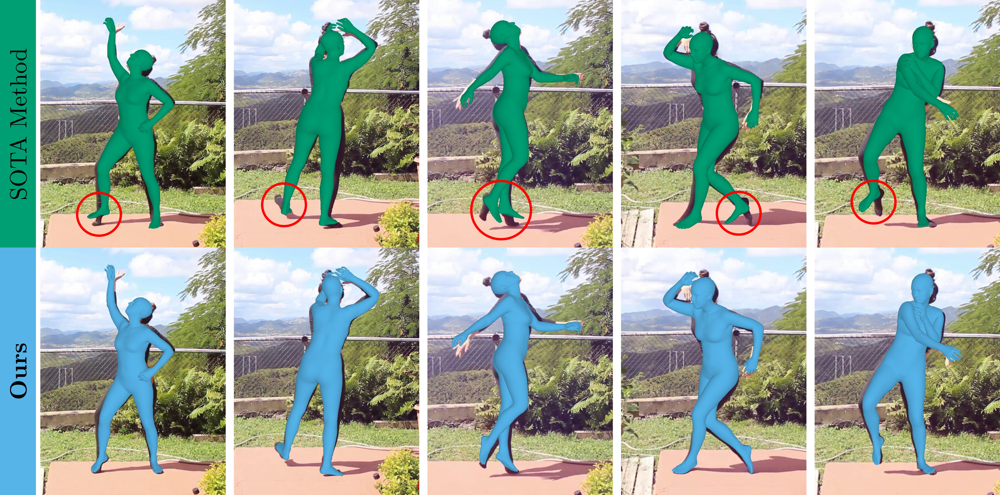

# Improving 3D Foot Motion Reconstruction in Markerless Monocular Human Motion Capture

[](https://twehrbein.github.io/footmr-website/) [](https://arxiv.org/abs/2603.09681)

> **Improving 3D Foot Motion Reconstruction in Markerless Monocular Human Motion Capture** <br>
> [Tom Wehrbein](https://www.tnt.uni-hannover.de/en/staff/wehrbein/) and [Bodo Rosenhahn](https://www.tnt.uni-hannover.de/en/staff/rosenhahn/) <br>
> 2026 International Conference on 3D Vision (3DV)

## Abstract



State-of-the-art methods can recover accurate overall 3D human body motion from in-the-wild videos. However, they often fail to capture fine-grained articulations, especially in the feet, which are critical for applications such as gait analysis and animation. This limitation results from training datasets with inaccurate foot annotations and limited foot motion diversity. We address this gap with FootMR, a Foot Motion Refinement method that refines foot motion estimated by an existing human recovery model through lifting 2D foot keypoint sequences to 3D. By avoiding direct image input, FootMR circumvents inaccurate image–3D annotation pairs and can instead leverage large-scale motion capture data. To resolve ambiguities of 2D-to-3D lifting, FootMR incorporates knee and foot motion as context and predicts only residual foot motion. Generalization to extreme foot poses is further improved by representing joints in global rather than parent-relative rotations and applying extensive data augmentation. To support evaluation of foot motion reconstruction, we introduce MOOF, a 2D dataset of complex foot movements. Experiments on MOOF, MOYO, and RICH show that FootMR outperforms state-of-the-art methods, reducing ankle joint angle error on MOYO by up to 30% over the best video-based approach.

## TODO

- [x] Project page
- [x] arXiv paper
- [ ] Code release (coming soon)
- [ ] MOOF dataset release (coming soon)

## Citation

Please cite our paper if you find this repository useful:

```bibtex
@InProceedings{wehrbein26footmr,
    author    = {Wehrbein, Tom and Rosenhahn, Bodo},
    title     = {Improving 3D Foot Motion Reconstruction in Markerless Monocular Human Motion Capture},
    booktitle = {International Conference on 3D Vision (3DV)},
    year      = {2026},
}
```
